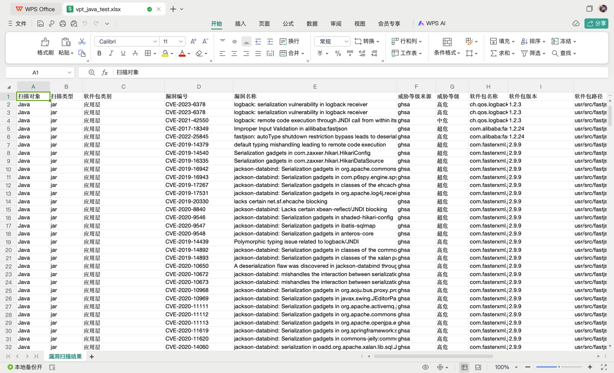
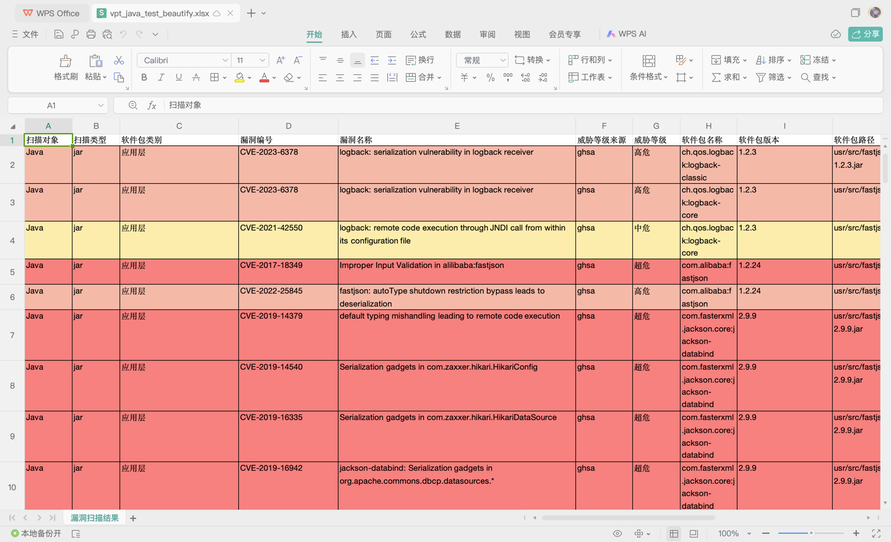
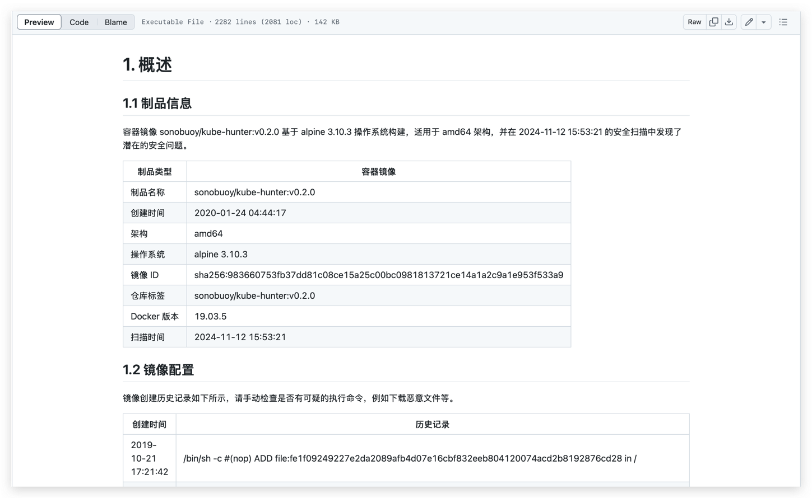

# 🔍  trivy-plugin-report

[English](./README_en.md)

📊 `trivy-plugin-report` 是一个可以将 [Trivy](https://github.com/aquasecurity/trivy) 输出的 JSON 格式的报告转换为 EXCEL 和 Markdown 的插件。

## 🤔 为什么需要它？

Trivy 可以输出多种格式的报告，但这些报告更适合技术人员使用。

在业务场景中，我们经常需要将安全风险以更易于理解的方式呈现给非技术人员，
这时候 EXCEL 文件就显得尤为重要。

此外，我们还需写一份综合性的扫描报告，该报告将概述制品信息、镜像配置、漏洞概览以及详细的漏洞信息。 
Markdown 格式的文档因其便于编辑和查阅的特点，非常适合作为此类报告的载体。

## 🌟 特性

- **Trivy 兼容性**：支持 Trivy 生成的 JSON 格式报告；
- **办公友好**：转换为 EXCEL 格式，适合非技术人员阅读和汇报；
- **便捷编辑共享**：Markdown 格式的扫描报告，便于快速编辑和共享关键安全信息。

## 🛠️ 安装方法

```shell
trivy plugin install github.com/miao2sec/trivy-plugin-report
```

## 🚀 使用方法

```shell
trivy image --format json -d --output plugin=report [--output-plugin-arg plugin_flags] <image_name>
```

或者

```shell
trivy image -f json <image_name> | trivy report [plugin_flags]
```

## 📝  常见用法

1. 生成 EXCEL 表格，并命名为 `output.xlsx`
    ```bash
    trivy image -f json debian:12 | trivy report --excel-file output.xlsx
    ```
    
    
    详情请看 [vpt_java_test.xlsx](excel/testdata/vpt_java_test.xlsx)

2. 使用 `--beautify` 将 EXCEL 表格美化。即，根据漏洞的威胁等级填充背景色。
   ```bash
   trivy image -f json debian:12 | trivy report --excel-file output-beautify.xlsx --beautify
   ```
   
   详情请看 [vpt_java_test_beautify.xlsx](excel/testdata/vpt_java_test_beautify.xlsx)
3. 生成 Markdown 文档，并命名为 `output.md`
    ```bash
   trivy image -f json sonobuoy/kube-hunter:v0.2.0 | trivy report --markdown-file output.md
    ```
   
   详情请看 [kube-hunter.md](markdown/testdata/kube-hunter.md)
4. 使用 `--brief` 将 Markdown 简化。即，去除漏洞描述和相关链接。 
    ```bash
   trivy image -f json tomcat:9.0.97-jre8-temurin-jammy | trivy report --markdown-file output.md --brief
    ```
   详情请看 [tomcat.md](markdown/testdata/tomcat.md)
## TODO
- [x] 📝 导出 markdown 文档
- [ ] 📝 导出 PDF 文档
- [x] 🌏 汉化报告
- [ ] 🌁 添加阿里云漏洞源
- [ ] 🚀 添加 CNNVD 漏洞源
- [ ] 🛡️ 支持错误配置、许可证和 secret